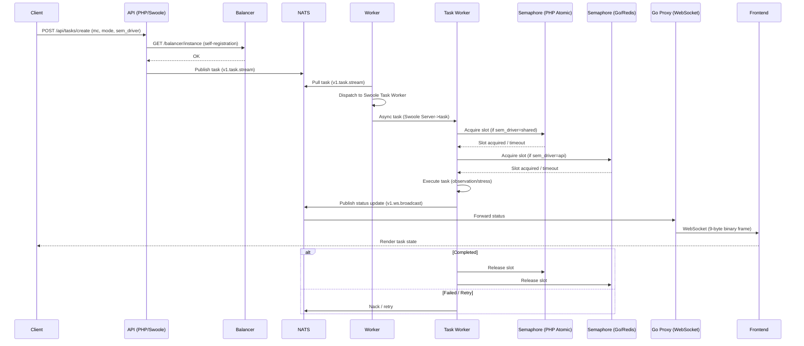

## Task Flow (Sequence Diagram)

```mermaid
sequenceDiagram
    participant Client
    participant API as API (PHP/Swoole)
    participant Balancer
    participant NATS
    participant Worker0 as Worker #0
    participant TaskWorker as Task Worker
    participant SemPHP as Semaphore (PHP Atomic)
    participant SemGo as Semaphore (Go/Redis)
    participant Proxy as Go Proxy (WebSocket)
    participant Frontend

    Client->>API: POST /api/tasks/create (mc, mode, sem_driver)
    API->>Balancer: GET /balancer/instance (self-registration)
    Balancer-->>API: OK

    API->>NATS: Publish task (v1.task.stream)

    Worker0->>NATS: Pull task (v1.task.stream)
    Worker0->>Worker0: Dispatch to Swoole Task Worker
    Worker0->>TaskWorker: Async task (Swoole Server->task)

    TaskWorker->>SemPHP: Acquire slot (if sem_driver=shared)
    SemPHP-->>TaskWorker: Slot acquired / timeout

    TaskWorker->>SemGo: Acquire slot (if sem_driver=api)
    SemGo-->>TaskWorker: Slot acquired / timeout

    TaskWorker->>TaskWorker: Execute task (observation/stress)

    TaskWorker->>NATS: Publish status update (v1.ws.broadcast)
    NATS->>Proxy: Forward status
    Proxy->>Frontend: WebSocket (9-byte binary frame)
    Frontend-->>Client: Render task state

    alt Completed
        TaskWorker->>SemPHP: Release slot
        TaskWorker->>SemGo: Release slot
    else Failed / Retry
        TaskWorker->>NATS: Nack / retry
    end
```
